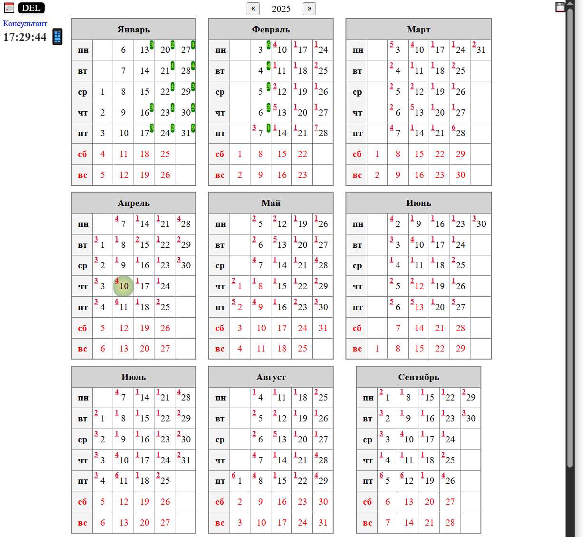
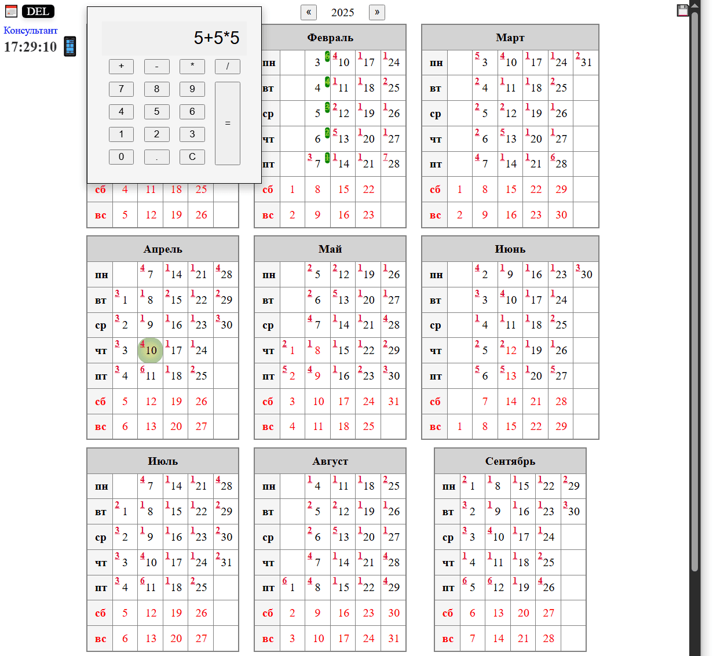

# Calendar
Приложение, построенное на HTML, CSS и JS для планирования целей и задач.

## Описание
Приложение представляет собой годовой календарь с группировкой по месяцам и дням. Выходные дни (суббота и воскресенье) выделены красным цветом. Также есть возможность выделять свои собственные выходные дни.

Каждый день в календаре имеет список целей и задач, отмеченных в верхней части дня:
- Задачи к выполнению помечены красным цветом.
- Завершенные задачи помечаются зеленым цветом и перечеркнутой линией.

При выборе любого дня в календаре открывается меню редактирования задач на день, где можно:
- Добавлять новые задачи.
- Удалять задачи.
- Помечать задачи как выполненные.

При добавлении новых задач есть возможность установить периодичность:
- Ежедневно.
- Еженедельно.
- Ежемесячно.
- Ежеквартально.

## Интерфейс и функции
- Текущий день в календаре выделен зеленым кружком.
- В левой верхней области отображается текущее время, калькулятор и быстрая ссылка на производственный календарь.
- В календаре имеется возможность перемещаться между годами, используя стрелочки влево и вправо в верхней части страницы, расположенные рядом с текущим годом.

## Хранение данных
Все данные и записи хранятся у пользователя в простом `.html` файле, который можно открыть через браузер. Чтобы сохранить текущие изменения в календаре, нужно нажать на кнопку с изображением дискеты в правой верхней части страницы и выбрать место для сохранения файла, либо перезаписать старый файл.

Если пользователь сделает какие-то изменения и закроет страницу без сохранения, будет выдано предупреждение, которое предотвращает случайную потерю данных.

## Скриншоты
### Общий вид приложения


### Калькулятор


### Записи задач и целей на текущий день


## Сжатие и хранение данных

Данные и код страницы хранятся в сжатом виде, чтобы уменьшить размеры сохраняемой страницы. Для сжатия используется собственный алгоритм.

### Алгоритм сжатия

1. **Массив символов для сжатия**:
   - Создается массив `SDICTB` размерностью 256 символов Юникода, который используется для кодирования данных. Символы представляют собой значения от 0 до 255.
    ```js
    const SDICTB = ['0','1','2','3','4','5','6','7','8','9',':',';','@','A','B','C','D','E','F','G','H','I','J','K','L','M','N','O','P','Q','R','S','T','U','V','W','X','Y','Z','[','a','b','c','d','e','f','g','h','i','j','k','l','m','n','o','p','q','r','s','t','u','v','w','x','y','z','À','Á','Â','Ã','Ä','Å','Æ','Ç','È','É','Ê','Ë','Ì','Í','Î','Ï','Ð','Ñ','Ò','Ó','Ô','Õ','Ö','Ø','Ù','Ú','Û','Ü','Ý','Þ','ß','à','á','â','ã','ä','å','æ','ç','è','é','ê','ë','ì','í','î','ï','ð','ñ','ò','ó','ô','õ','ö','÷','ø','ù','ú','û','ü','ý','þ','ÿ','Ā','ā','Ă','ă','Ą','ą','Ć','ć','Ĉ','ĉ','Ċ','ċ','Č','č','Ď','ď','Đ','đ','Ē','ē','Ĕ','ĕ','Ė','ė','Ę','ę','Ě','ě','Ĝ','ĝ','Ğ','ğ','Ġ','ġ','Ģ','ģ','Ĥ','ĥ','Ħ','ħ','Ĩ','ĩ','Ī','ī','Ĭ','ĭ','Į','į','İ','IJ','ij','Ĵ','ĵ','Ķ','ķ','ĸ','Ĺ','ĺ','Ļ','ļ','Ľ','ľ','Ŀ','ŀ','Ł','ł','Ń','ń','Ņ','ņ','Ň','ň','ʼn','Ŋ','ŋ','Ō','ō','Ŏ','ŏ','Ő','ő','Œ','œ','Ŕ','ŕ','Ŗ','ŗ','Ř','ř','Ś','ś','Ŝ','ŝ','Ş','ş','Š','š','Ţ','ţ','Ť','ť','Ŧ','ŧ','Ũ','ũ','Ū','ū','Ŭ','ŭ','Ů','ů','Ű','ű','Ų','ų','Ŵ','ŵ','Ŷ','ŷ','Ÿ','Ź','ź','Ż','ż','Ž','ž','ſ'];
    ```
2. **Список уникальных символов**:
   - Формируется список уникальных символов в тексте, отсортированный по убыванию оригинального кода символа.
    ```js
    var sourceSymb = [
        {
            "symb": "ь",
            "count": 1,
            "code": 1100,
            "sdict": "0",
            "dex": 0
        },
        {
            "symb": "ы",
            "count": 1,
            "code": 1099,
            "sdict": "1",
            "dex": 1
        },
        {
            "symb": "ш",
            "count": 2,
            "code": 1096,
            "sdict": "2",
            "dex": 2
        },
    ...
    ]
    ```
3. **Сжатая таблица символов**:
   - Функция `encryptTable` формирует сжатую таблицу уникальных символов, кодируя их в байты. Первые два бита каждого байта содержат команду (прибавить единицы, сотни, умножить или идти последовательность), а следующие шесть бит — значение команды.
    ```js
    var zipTable = 'T2Á1z7z7z8Á1É1Á1Å1z2À9z6z5z2z3ňó2Ï3z2zAz1À1À20';
    ```
4. **Поиск повторов**:
   - Производится поиск повторяющихся подстрок в тексте, начиная с минимальной длины 4 символов. Если найденная подстрока достаточно длинна и сжатие эффективно, она кодируется в компактную форму, записывая смещение и длину повторения.  
    Индекс смещения может быть как отрицательный, предыдущее совпадение значит нужно искать с конца запакавонной строки, так положительный, индекс находится с начала запакованной строки, например таблица совпадений
    ```js
    var matches = [
        {i: -327, l: 15},   // 'űC2Ď'
        {i: 994, l: 7},     // 'ű77ń'
        {i: -2202, l: 8},   // 'ű8En'
        ...
    ];
    ```
1. **Кодирование символов**:
   - Если подстрока не может быть сжата эффективно, каждый символ кодируется отдельно с помощью функции `getCodeBySymbol`, которая возвращает соответствующий код из таблицы `SDICTB`.

### Пример сжатия

- Исходная строка длиной 6600 символов может быть сжата до 3300 символов, что дает степень сжатия 50%.  
  Пример сжатой строки:
    ```js
    var zippedStr = `T2Á1z7z7z8Á1É1Á1Å1z2À9z6z5z2z3ňó2Ï3z2zAz1À1À20dRXgSaWXÊSÉNQiUÎUÆarÌÌÆliÆTkrŰ@0adÊÍSMMÌTSUaXcÌÍrSOVeWdÎSÉUeSRUXÎgWXTWZeÄZWcÊÌJ2CHAIÍÎKE87IGC@0:9Î8E7EFI:IÎ6579AIÌÉtŰ4LXÆUrlkÆarÃtdWUÊXrÃtXsSÄZeXcSbtXÇÇŰ6HireÄaXfePndÊSlXkÉtadÊÅÂrriŰUăEF6AID4E;1BÎ6C;G9@ÎGÎC639F:9BŰ6ŦEÌŰ5ĠÃrraÉariÆUÄVRTbÊiÉteZTeÎadÊiqqxrrÀÉaÈrÂvÁjiŰClÁÉaÇrÂÃÃÈÊÂÁwjŰEðÂŰ4xxzŰ7îŰ5ÎÊiqÃÉÉhUei[ű51JtiqÃtiÅÅÉaÇÇű811aÉLLű61ąlUÄUeQeUTeÊÉÄYiVÊÊÊSÆXÉrqÊNTOYhumŰ5ãÄdUWYobiUoWfeÊSÉÆgWfeuSÆTfagSuelXkÆfePuXLÉÉÉÆXkLŰ4ÅWrerqiÄdaXfÊÊSrqSÄfePrreÉÉÄŰ4ĵtadÊiÉNdWUÊUrTÇÂtUű:1cUű81yZűA1ÐUű61íZqqzrrÂyŰ6ÅdrÂÇÊÀËZqqÁÉÆfŰ7OÉÆgrXÊSÄTRhŰ6áÊUÇÂÆUÇÂÇdÉÉÆcŰFrÇdŰ6vÇfÉÆÍÃÉtcrcqrÃpcuaű71bÇcÆaÇraŰ;ìcÆcÇgÉÆUÇrdÇfLű62įÇrWÊZÉű72ķÎaLL`
    ```
### Минификация кода

- Перед сжатием скриптов код предварительно минифицируется с помощью функции `Terser.minify`, удаляя лишние пробелы, переносы, комментарии и сокращая названия переменных.

### Распаковка

- Распаковка сжатой строки происходит в обратном порядке.

### Исходный код

- Исходный код функции можно посмотреть в папке `src` репозитория.
